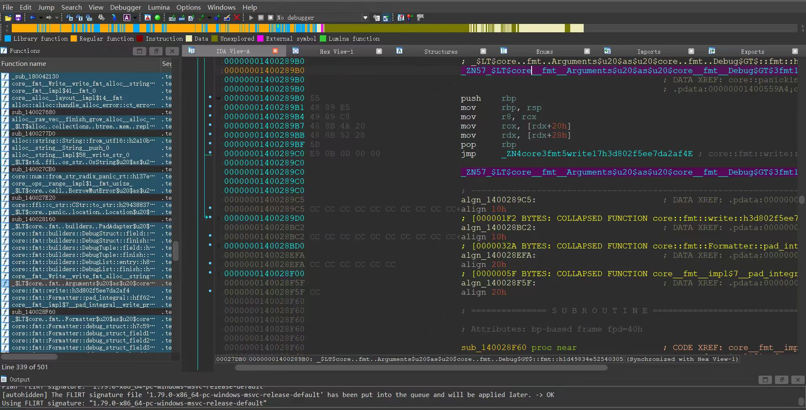
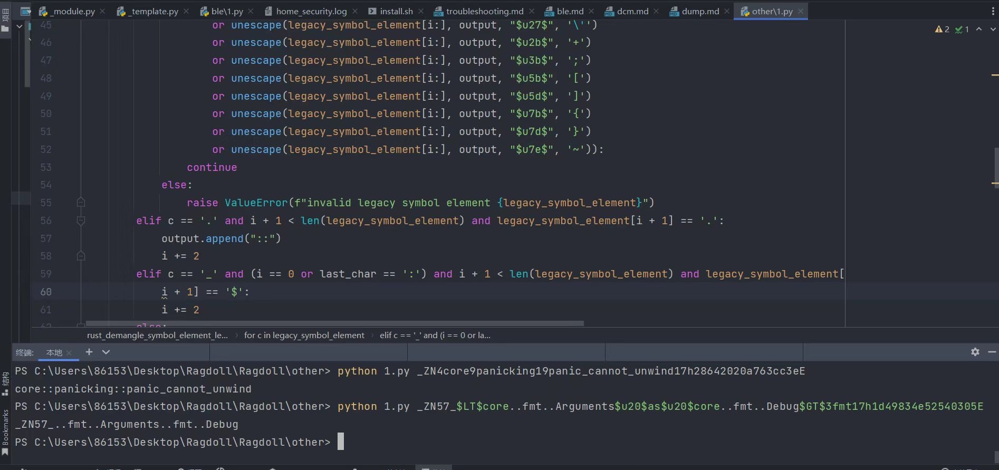

`useage:python3 Rust-Demangler.py [string]`
 Rust-Demangler is a python tool for demangling symbol names that are mangled with the Rust convention. It takes a mangled symbol name as input and returns the demangled name.

   